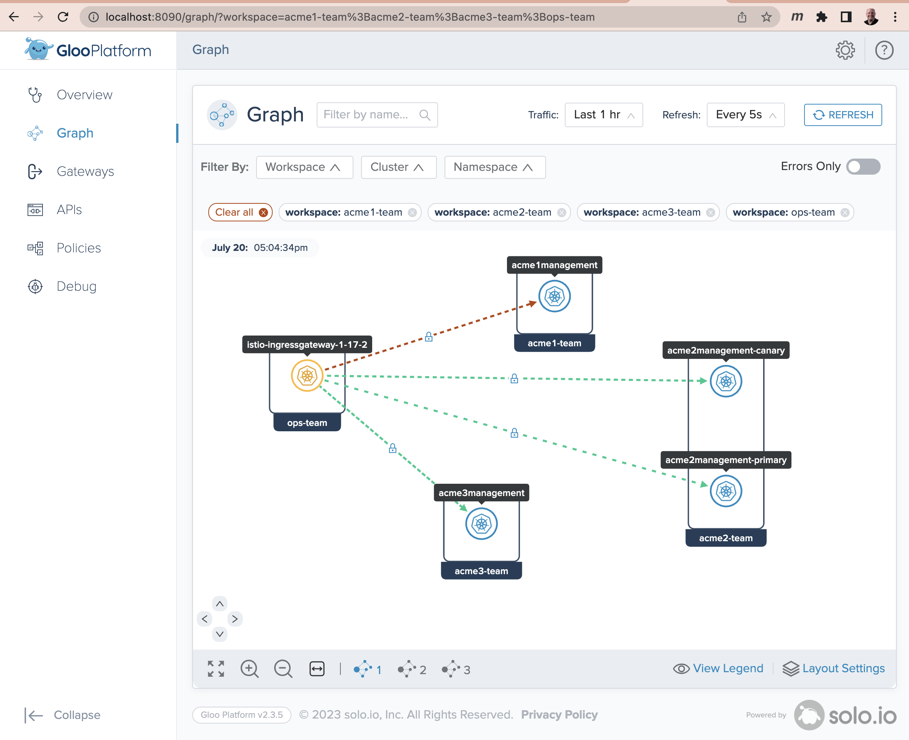

# A Gloo Platform Multi-Tenancy Example

This example illustrates Gloo Platform's support for multi-tenancy and how it can lead to better results when managing the configuration of multiple project teams, as compared with open-source Istio.

## Clone GitHub repo

To get started with this example, clone this repo.

```sh
git clone https://github.com/jameshbarton/acme.git
cd acme
```
## Install Istio / Gloo Platform

If you don’t have Gloo Platform installed, there is a simplified installation script available in the GitHub repo you cloned in the previous section. Before you walk through that script, you’ll need three pieces of information.

* Place a Gloo license key in the environment variable GLOO_GATEWAY_LICENSE_KEY. If you don’t already have one of these, you can obtain it from your Solo account executive.

* Supply a reference to the repo where the hardened Solo images for Istio live. This value belongs in the environment variable ISTIO_REPO. You can obtain the proper value from [this location](https://support.solo.io/hc/en-us/articles/4414409064596) once you’re a Gloo Mesh customer or have activated a free trial. This example was tested with Istio v1.17.2.

* Supply a version string for Gloo Mesh Gateway in the environment variable GLOO_MESH_VERSION. For the tests we are running here, we use v2.3.4.

If you’ve never installed any Gloo Platform technology before, you will need to import a Gloo Platform helm chart before the installation script below will work properly.

```sh
helm repo add gloo-platform https://storage.googleapis.com/gloo-platform/helm-charts
helm repo update
```

Now from the `acme` directory at the top level of the cloned repo, execute the setup script below. It will configure a local k3d cluster containing Gloo Platform and an underlying Istio deployment. The script will fail if any of the three environment variables above is not present.

```sh
./setup/setup.sh
```

The output from the setup script should indicate that you have a healthy cluster with a healthy instance of Istio with Gloo Platform. If you require a more complex installation, a more complete Gloo Platform installation guide is available [here](https://docs.solo.io/gloo-mesh-enterprise/latest/getting_started/). 

We will simulate an environment where four teams need to cooperate in order to support a suite of application services.
* An operations team responsible for the platform itself (ops-team); and
* Three application teams (acme1, acme2, acme3) responsible for their own sets of services.

## Spin Up the Base Services

We'll establish a Kubernetes namespace `ops-team` to hold configuration owned by Operations. Then we will establish separate namespaces for each of the three application teams: `acme1-istio-test`, `acme2-istio-test`, and `acme3-istio-test`. Note that these namespaces are all labeled with `istio-injection: enabled` to enable automatic Istio sidecar injection for workloads that are created within these application workspaces.

We'll also establish separate Gloo workspaces for each of the four teams with appropriate import/export rules.

```sh
# Establish namespaces
kubectl apply -f ./common/namespaces.yaml
```

We'll also spin up 3 sets of application services. For acme1 and acme3, each namespace will contain just a single replica of a single service. For acme2, we will simulate a canary upgrade by simultaneously deploying two services with separate labels to indicate a `primary` and a `canary` version. The services for each team are based on the [Fake Service](https://github.com/nicholasjackson/fake-service) to keep this example as simple as possible. 

```sh
# Spin up Acme services for each team
kubectl apply -f ./common/acme1.yaml
kubectl apply -f ./common/acme2.yaml
kubectl apply -f ./common/acme3.yaml
```

## Manage Multiple Tenants with Gloo Platform

First, we'll use a Gloo Platform CRD called `Workspace` to lay down Kubernetes boundaries for multiple teams within the organization. These `Workspace` boundaries can span both Kubernetes clusters and namespaces. In our case we'll define four `Workspaces`, one for the `ops-team` that owns the overall service mesh platform, and three for each of the application teams to whom we want to delegate routing responsibilities.

Below is a sample Workspace and its companion WorkspaceSettings for the app1-team. Note that it includes the app-1 Kubernetes namespace across all clusters. While there is only a single cluster present in this example, this Workspace would dynamically expand to include that same namespace on other clusters added to our mesh in the future. Note also that via the WorkspaceSettings, tenants can choose precisely what resources they are willing to export from their workspace and who is able to consume them. See the [API reference](https://docs.solo.io/gloo-gateway/latest/reference/api/workspace_settings/) for more details on workspace import and export.

```yaml
apiVersion: admin.gloo.solo.io/v2
kind: Workspace
metadata:
  name: app1-team
  namespace: gloo-mesh
  labels:
    team-category: app-team
spec:
  workloadClusters:
  - name: '*'
    namespaces:
    - name: app-1
---
apiVersion: admin.gloo.solo.io/v2
kind: WorkspaceSettings
metadata:
  name: app1-team
  namespace: app-1
spec:
  exportTo:
    - workspaces:
      - name: ops-team
```

Let's apply the `Workspace` definitions now:

```sh
# Establish Gloo workspaces for all teams
kubectl apply -f ./gloo/ws-opsteam.yaml
kubectl apply -f ./gloo/ws-appteams.yaml
```


Second, we'll lay down a `VirtualGateway` that selects the Istio Ingress Gateway on our cluster and delegates traffic to `RouteTables` for each of three hostnames that map to our three application teams. 

```sh
kubectl apply -f ./gloo/acme-http-gateways.yaml
```

The above example uses HTTP listeners. There is also sample `VirtualGateway` [config](./gloo/acme-gateways-gloo.yaml) provided for HTTPS listeners when an appropriate `*.btcloudentitypoc.net` wildcard cert is available. More documentation on how to configure HTTPS is available [here](https://docs.solo.io/gloo-gateway/latest/listeners/https/).

Third, we'll configure `RouteTables` that are owned entirely by the application teams. They establish routes created by the three application teams. We will establish a 10s timeout policy for each set of routes by creating `RetryTimeoutPolicy` objects for each team and attach those to our routes via the label `policy: timeout-10s`.

```sh
# Establish route tables
kubectl apply -f ./gloo/acme-route-tables-gloo.yaml
# Attach 10s timeout policies dynamically
kubectl apply -f ./gloo/acme-timeout-10s.yaml
```

Here is the `RouteTable` that manages the 70-30 split across primary and canary services for the acme2 team.

```yaml
apiVersion: networking.gloo.solo.io/v2
kind: RouteTable
metadata:
  name: acme2management
  namespace: acme2-istio-test
spec:
  hosts:
    - acme2management.btcloudentitypoc.net
  virtualGateways:
    - name: acme-gateway
      namespace: ops-team
  workloadSelectors: []
  http:
    - name: acme2management-routes
      labels:
        policy: timeout-10s
      matchers:
      - uri:
          prefix: /v1/acme2s
      - uri:
          prefix: /v1/somemessage
      forwardTo:
        destinations:
          - ref:
              name: acme2management
              namespace: acme2-istio-test
            subset:
              version: primary
            weight: 70
          - ref:
              name: acme2management
              namespace: acme2-istio-test
            subset:
              version: canary
            weight: 30
```

Note that the provision of the `RouteTable` causes Gloo to automatically generate the lower-level Istio `DestinationRules` required to implement the canary routing. Here is one example:

```sh
kubectl get destinationrules -n acme2-istio-test -o yaml
```

```yaml
apiVersion: v1
items:
- apiVersion: networking.istio.io/v1beta1
  kind: DestinationRule
  metadata:
    annotations:
      cluster.solo.io/cluster: gloo
    creationTimestamp: "2023-07-20T13:22:23Z"
    generation: 1
    labels:
      context.mesh.gloo.solo.io/cluster: gloo
      context.mesh.gloo.solo.io/namespace: acme2-istio-test
      context.mesh.gloo.solo.io/workspace: acme2-team
      gloo.solo.io/parent_cluster: gloo
      gloo.solo.io/parent_group: ""
      gloo.solo.io/parent_kind: Service
      gloo.solo.io/parent_name: acme2management
      gloo.solo.io/parent_namespace: acme2-istio-test
      gloo.solo.io/parent_version: v1
      reconciler.mesh.gloo.solo.io/name: translator
    name: acme2management-acme2-istio-tes-19008c821234b7975b1971055b631d1
    namespace: acme2-istio-test
    resourceVersion: "39253"
    uid: 6094adb3-d709-44b1-a7d9-adeea96e0bb3
  spec:
    exportTo:
    - .
    host: acme2management.acme2-istio-test.svc.cluster.local
    subsets:
    - labels:
        version: primary
      name: version-primary
    - labels:
        version: canary
      name: version-canary
kind: List
metadata:
  resourceVersion: ""
```

## Test the Gloo Services

Here are some suggested tests with results for the services of each of the three application teams.

### Acme1

#### Success

```sh
curl -H "host: acme1management.btcloudentitypoc.net" http://localhost:8080/v1/acme1s -i
```

```json
HTTP/1.1 200 OK
vary: Origin
date: Thu, 20 Jul 2023 20:33:36 GMT
content-length: 285
content-type: text/plain; charset=utf-8
x-envoy-upstream-service-time: 18
server: istio-envoy

{
  "name": "acme1management",
  "uri": "/v1/acme1s",
  "type": "HTTP",
  "ip_addresses": [
    "10.42.0.29"
  ],
  "start_time": "2023-07-20T20:33:36.929110",
  "end_time": "2023-07-20T20:33:36.930134",
  "duration": "1.025ms",
  "body": "Hello From acme1management",
  "code": 200
}
```

#### 404 Failure

```sh
curl -H "host: acme1management.btcloudentitypoc.net" http://localhost:8080/v1/bad-route -i
```

```
HTTP/1.1 404 Not Found
date: Thu, 20 Jul 2023 20:34:30 GMT
server: istio-envoy
content-length: 0
```

### Acme2 

#### Canary Routing

In this case we have a 70-30 split across a `Primary` and a `Canary` route. We'll repeat the curl command 10 times and should see results that match that 70-30 expectation over a large sample size.

```sh
repeat 10 curl -H "host: acme2management.btcloudentitypoc.net" http://localhost:8080/v1/acme2s -is | grep body
```

```
  "body": "Hello From acme2management Primary",
  "body": "Hello From acme2management Primary",
  "body": "Hello From acme2management Canary",
  "body": "Hello From acme2management Primary",
  "body": "Hello From acme2management Primary",
  "body": "Hello From acme2management Canary",
  "body": "Hello From acme2management Canary",
  "body": "Hello From acme2management Primary",
  "body": "Hello From acme2management Primary",
  "body": "Hello From acme2management Primary",
```

#### 404 Failure

```sh
curl -H "host: acme2management.btcloudentitypoc.net" http://localhost:8080/v1/BAD-ROUTE -i
```

```
HTTP/1.1 404 Not Found
date: Thu, 20 Jul 2023 20:41:58 GMT
server: istio-envoy
content-length: 0
```

### Acme3

#### Success

```sh
curl -H "host: acme3management.btcloudentitypoc.net" http://localhost:8080/v1/acme3s -i
```

```json
HTTP/1.1 200 OK
vary: Origin
date: Thu, 20 Jul 2023 20:35:26 GMT
content-length: 285
content-type: text/plain; charset=utf-8
x-envoy-upstream-service-time: 20
server: istio-envoy

{
  "name": "acme3management",
  "uri": "/v1/acme3s",
  "type": "HTTP",
  "ip_addresses": [
    "10.42.0.28"
  ],
  "start_time": "2023-07-20T20:35:26.714818",
  "end_time": "2023-07-20T20:35:26.716036",
  "duration": "1.218ms",
  "body": "Hello From acme3management",
  "code": 200
}
```

#### 404 Failure

```sh
curl -H "host: acme3management.btcloudentitypoc.net" http://localhost:8080/v1/BAD-ROUTE -i
```

```
HTTP/1.1 404 Not Found
date: Thu, 20 Jul 2023 20:37:36 GMT
server: istio-envoy
content-length: 0
```

## Observability with Gloo Dashboard

In addition to supporting unambiguous multi-tenant routing, Gloo Platform also allows you to observe what's happening among the tenants of your service mesh. A convenient way to visualize traffic flows and debug using Gloo Platform is to use the flow graph bundled with the Gloo Platform UI. (These metrics can also be forwarded to your favorite SIEM tool for storage and analysis.)

An easy way to enable this at development time is to port-forward the interface of the `gloo-mesh-ui` service, like this:

```sh
meshctl dashboard
```

This should open a browser tab pointed at http://localhost:8090. Switch to Graph on the left navigation menu. Next to the `Filter By:` label, be sure to select all Workspaces, all Clusters, and all Namespaces. After a few seconds to allow for telemetry collection and processing, you’ll see a graph like the one below. It shows you the traffic moving between the ingress gateway and the four services we established, across all three workspaces. (You may also want to fire off a few additional curl commands like the one above to the gateway endpoint in order to make the statistics slightly more interesting.)



## Exercise Cleanup

If you used the setup.sh script described earlier to establish your Gloo Platform environment for this exercise, then there is an easy way to tear down the environment as well. Just run this command:

```sh
./setup/teardown.sh
```

## Want to learn more about Gloo Platform?

Read more about Gloo Platform on the [Solo website](https://www.solo.io/products/gloo-platform/) and in the [product documentation](https://docs.solo.io/).
